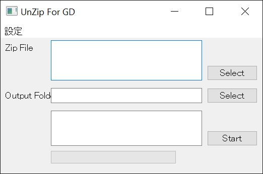

# UnzipGD
  

- 大量のzipファイルを自動で解凍処理するアプリです．
- google driveから大量のファイルをダウンロードする場合，強制的に複数のzipファイルに分割されてしまいます．これらのzipファイルを一つ一つ手動で解凍するのはとても大変です．このアプリはこの問題を解決するために作られました．

- This app extracts multiple .zip files at once.
- When downloading a large number of files from google drive, they are forced to be split into multiple zip files. This is useful for unzipping these zip files.

- このアプリのコーディング，GUIデザイン，デバッグを始めとした全ての開発プロセスにおいて，冨樫 綾 氏 ([@a-aat](https://github.com/a-aat)) に多大なる力を尽くしていただきました．また，野口 凛人 氏([@Rinto-Noguchi](https://github.com/Rinto-Noguchi))にはプロジェクトの立案からデバッグに至る全てのプロセスを主導していただきました．伊庭 靖弘 氏にはプロジェクト全体の統括をしていただきました．ここに感謝申し上げます．
- The whole development process (coding, GUI desigining, debugging etc.) of this app is with the great works by Aya Togashi ([@a-aat](https://github.com/a-aat)). Rinto Noguchi([@Rinto-Noguchi](https://github.com/Rinto-Noguchi)) led the entire process from project planning to debugging. Yasuhiro Iba supervised the entire project. We appreciate their contribution.

## 使い方(非Githubユーザー向け)
- こちらからアプリが入っているzipファイルをダウンロードしてください．   
https://github.com/hokudai-paleo/UnzipGD/releases/tag/v3.1

## How to use(for non-Github users)
- Click the link below to download zip. The app is in it.   
https://github.com/hokudai-paleo/UnzipGD/releases/tag/v3.1

## 使い方(Githubユーザー向け)
- 実行ファイルはv3.1>dist>UnzipGD31.exeです．
- ご自身でソースから実行ファイルを作る場合は`pyinstaller main.py --onefile`で作れます．
  - PyQtやpyinstallerなどの必要なライブラリを予めインストールしてください．

## How to use(Github users)
- The execution file is v3.1>dist>UnzipGD31.exe.
- Build from the source by `pyinstaller main.py --onefile`.
  - You need to install PyQt, pyinstaller and other libraries required.
